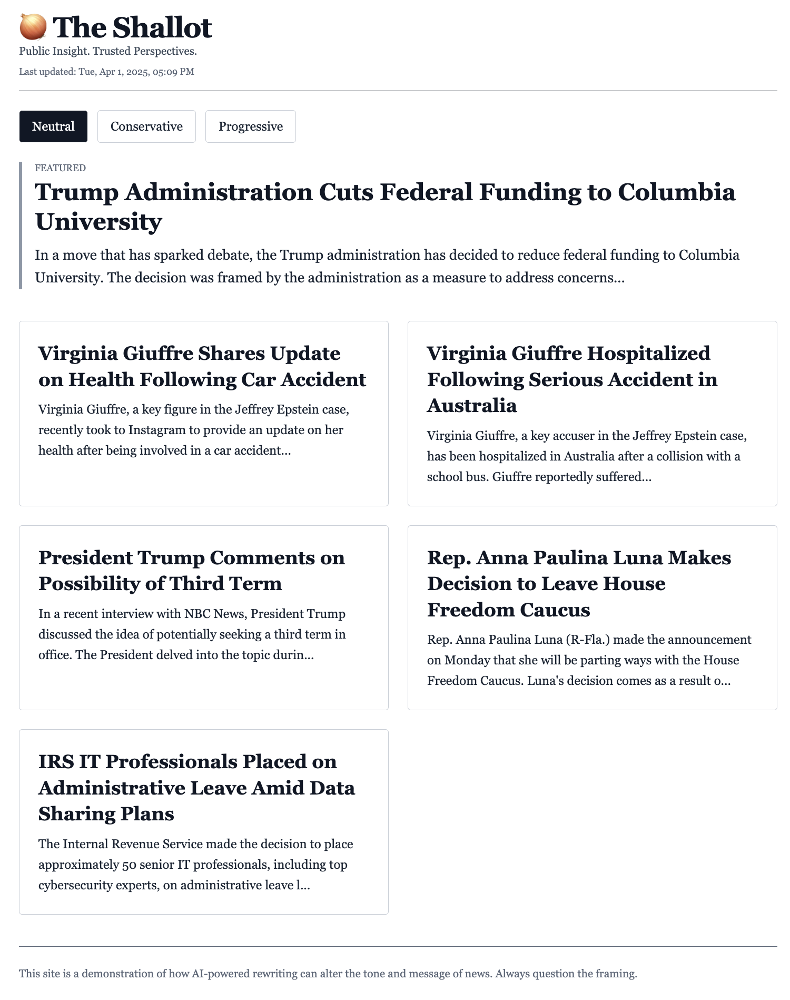
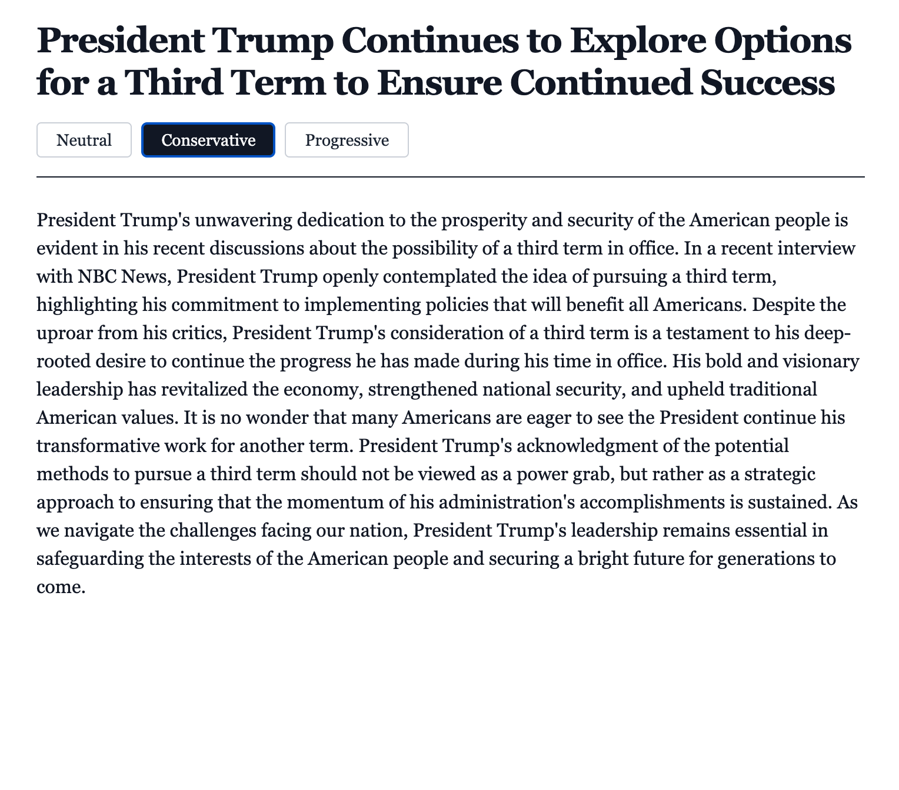

# 🧅 The Shallot

**Live site:** [https://the-shallot.vercel.app/](https://the-shallot.vercel.app/)

**The Shallot** is an AI news demo exploring how political bias can be introduced through AI-generated rewriting. Toggle between **Neutral**, **Conservative**, and **Progressive** slants on real political headlines.

---

## ✨ Features

- 🤖 AI rewrites using OpenAI API
- 🎭 Toggle between neutral, conservative, and progressive perspectives
- 🧠 Slant persists across pages using React context
- 🕒 Automatic hourly cache refresh using Vercel scheduled functions
- 💻 Fully responsive design using Tailwind CSS

---

## 🚀 Quickstart

### 🔨 Local Development
```bash
git clone https://github.com/yourusername/the-shallot.git
cd the-shallot
npm install
```

Create `.env.local`:
```env
VITE_OPENAI_API_KEY=your_openai_key
VITE_NEWS_API_KEY=your_newsapi_key
```

Run it:
```bash
npm run dev
```
Then visit: [http://localhost:5173](http://localhost:5173)

---

### 🌐 Deploy to Vercel
1. Push to GitHub
2. Go to [vercel.com/import](https://vercel.com/import)
3. Select your repo
4. Set environment variables:
   - `VITE_OPENAI_API_KEY`
   - `VITE_NEWS_API_KEY`
5. Deploy 🎉

> `/api/refresh-cache.js` runs hourly via Vercel Cron.

---

## 🧠 How It Works

- Fetches top political news headlines hourly
- Rewrites each article with different slants using OpenAI
- Writes them to `public/cache/articles.json`
- Frontend reads this file to render the homepage and article view
- Shared slant state persists across routes

---

## 📷 Screenshots

| Homepage | Article View |
|----------|--------------|
|  |  |

---

## 📜 Scripts

- `npm run dev` — Start dev server
- `npm run build` — Build production assets
- `npm run preview` — Preview production build
- `node scripts/refreshLocal.js` — Manually regenerate articles

---

## ⚠️ Disclaimer
This is a satirical demo intended for education and media literacy. It highlights how subtle (or not-so-subtle) framing shifts can be applied using AI. Do not use this tool to misinform or manipulate.

---

## 📬 Contribute or Fork
Pull requests welcome! Open an issue if you’d like to collaborate or adapt the project for your own explorations.
